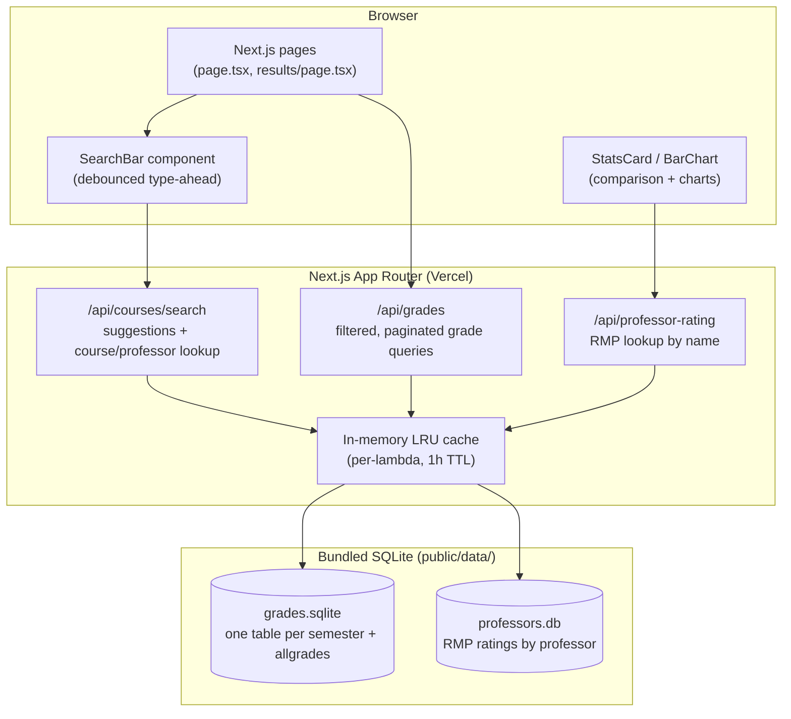
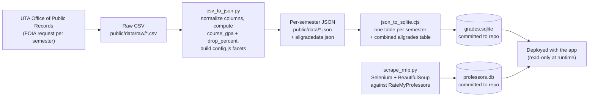

# MavGrades

MavGrades is a searchable database of historical grade distributions for courses and professors at the University of Texas at Arlington (UTA), built and maintained by ACM @ UTA.

**Status:** Active (live at [mavgrades.com](https://www.mavgrades.com))

## What problem this solves

UTA does not publish grade distributions anywhere a student can search them. Students pick sections without knowing how a class or professor has historically graded, which makes course registration a guessing game. MavGrades takes public grade-distribution records obtained from UTA under a Texas Public Information Act request, cleans and aggregates them, and puts them behind a fast search UI so students can look up a course or instructor and see the grade breakdown before they register.

## Core functionality

- **Search**: type-ahead search across courses and professors (`/api/courses/search`), matching on subject/catalog number, course title, or instructor name.
- **Grade distributions**: per-section grade breakdowns (A/B/C/D/F/I/P/Q/W/Z/R), aggregate course GPA, and drop/withdraw rate, filterable by year, semester, and academic career.
- **Professor lookup**: RateMyProfessors data (quality rating, difficulty, would-take-again, tags) joined onto UTA sections where a name match can be made.
- **Comparisons**: select multiple sections/instructors for a course and compare their grade distributions side by side (`StatsCard`, `BarChart`).
- **FAQ / data provenance page** explaining where the data comes from and its limitations.

Coverage today: Fall 2020 through the 2024-2025 academic year (15+ semesters), regenerated as ACM UTA requests and receives new semesters from UTA's Office of Public Records.

## Architecture

MavGrades is a single Next.js 14 (App Router) application. There is no separate backend service: API routes under `src/app/api` run as Next.js route handlers and query a SQLite database that ships inside the deployed app (`public/data/grades.sqlite`, `public/data/professors.db`). There is no user-facing database write path and no authentication — every request is a read against pre-built, static grade data.



## Data pipeline (offline, run by maintainers)

New grade data does not arrive through the running app. ACM UTA officers request each semester's grade-distribution CSV from UTA's public records office by FOIA-style email (template in `public/data/README.md`), then run a two-stage local script to turn it into the SQLite file the app ships:



`npm run process` runs the CSV-to-JSON and JSON-to-SQLite steps in sequence (`package.json`). `scrape_rmp.py` is run separately and is not wired into `npm run process`; it depends on Selenium, a Firefox/GeckoDriver install, BeautifulSoup, and `fuzzywuzzy`, none of which are declared in a `requirements.txt` in the repo (see Known limitations).

## Key technical decisions

- **SQLite shipped inside the deployment artifact, not a hosted database.** The dataset (grade rows for 15+ semesters) is small and effectively read-only between data refreshes, so there is no separate database service to provision, pay for, or keep in sync. The tradeoff is that publishing new semester data means committing an updated `.sqlite` file and redeploying, not an out-of-band data load.
- **One SQLite table per semester (`2024-fall`, `2025-spring`, ...) plus a denormalized `allgrades` table.** Per-semester tables keep single-semester queries small; `allgrades` (built by unioning all of them) backs "all time" search and comparison views. The route handlers pick a table (or `UNION ALL` several) based on the year/semester the caller asked for.
- **Route-level LRU cache (`lru-cache`, 1000 entries, 1h TTL) in front of every API handler.** Query results are cached by full request URL inside each serverless function instance. This cuts repeat-query latency and SQLite load for popular courses/professors without needing a separate cache service, at the cost of the cache being cold per-lambda-instance and not shared across instances or deploys.
- **Course GPA excludes P and R grades**, matching UTA's published grading policy (see the code comment/link in `csv_to_json.py`), after an explicit correction from an earlier version of the pipeline that included them.
- **Professor identity is matched by normalized first/last name between UTA's instructor field and RMP**, not a stable ID, because UTA's export has no cross-reference to RMP. Ambiguous or unmatched names are recorded in a `skipped_profs` table rather than guessed.

## Setup

Prerequisites: Node.js 20.x, npm.

```bash
git clone https://github.com/acmuta/mavgrades
cd mavgrades
npm install
npm run dev
```

Open http://localhost:3000. The app runs entirely off the SQLite files already committed under `public/data/` — no environment variables or external services are required to run it locally.

To regenerate the SQLite database from raw CSVs after adding a new semester to `public/data/raw/`:

```bash
npm run process
```

The RateMyProfessors scraper (`public/data/scrape_rmp.py`) is a separate, manually run Python script; it needs a Python environment with `selenium`, `beautifulsoup4`, `webdriver-manager`, and `fuzzywuzzy` installed, plus Firefox, none of which are pinned in the repo (`PLACEHOLDER: add a requirements.txt or document versions if this script should be reproducible by new contributors`).

## Usage

- `npm run dev` — local dev server with Turbopack.
- `npm run build` / `npm run start` — production build and serve.
- `npm run lint` — Next.js/ESLint checks.
- `npm run process` — regenerate `grades.sqlite` from `public/data/raw/*.csv`.

API surface (all read-only, no auth):
- `GET /api/courses/search?query=...` — type-ahead suggestions (courses + professors).
- `GET /api/courses/search?course=...` or `?professor=...` — full section/grade rows for a course or professor.
- `GET /api/grades?year=&semester=&subjectId=&instructor=&minGpa=&sort=&limit=...` — filtered, sorted, paginated grade query across one or more semester tables.
- `GET /api/professor-rating?name=...` — RMP rating lookup for a single professor.

## Testing

There is no automated test suite in this repository at the time of this refresh (no `test` script in `package.json`, no test files found). Verification today is manual (checking search results and grade numbers against the source CSVs). Adding automated tests, at minimum around the CSV/JSON/SQLite pipeline and the API route query-building logic, is an open item.

## Deployment

Deployed on Vercel from the `main` branch (confirmed live, `server: Vercel`, HTTP 200 at the time of this refresh). `.github/pull.yml` auto-syncs `main` from an earlier upstream template repository (`lryanle:master`) with a hard reset rule; this repo has since diverged well beyond that template. There is no GitHub Actions CI in the repository; linting/build checks are whatever Vercel's own build step enforces on deploy.

## Known limitations

- No automated tests.
- The RMP scraper has no pinned dependency list and is not part of the reproducible `npm run process` pipeline.
- Professor matching between UTA data and RMP is name-based and can miss or misattribute professors with common names or naming variants; unmatched names are dropped into `skipped_profs`, not surfaced to the end user.
- Data freshness is bounded by how quickly UTA's public records office fulfills each semester's FOIA-style request; there is a real, sometimes multi-month lag between a semester ending and its grades appearing on the site.
- Grade data volume grows unbounded inside a single committed SQLite file (`grades.sqlite` is ~21MB as of this refresh); there's no pruning or archival strategy documented.

## Team & attribution

MavGrades is a project of the [Association for Computing Machinery at UT Arlington (ACM @ UTA)](https://acmuta.com), built and maintained by a rotating group of student contributors. Contributor history (`git shortlog`) shows sustained work from Kevin Farokhrouz, Atiqur Rahman, and Talha Tahmid, alongside contributions from Md Rashidul Alam Sami, Devrat Patel, Vincent Dang, Md Ahanaful Alam, Parmesh Walunj, Muhammad Hunain Khurram, and others across ACM UTA's project team.

`PLACEHOLDER — needs owner confirmation`: git history in this repository shows no commits authored by Prajit Viswanadha; if he has a role on this project (org maintainer, reviewer, data-request coordinator, etc. that doesn't show up as a commit), that should be added here explicitly rather than implied.

## License

Custom license (`LICENSE.md`): free to use and redistribute with attribution, no derivative works without permission from ACM @ UTA, non-commercial use only. The underlying grade dataset is separately licensed under Creative Commons Attribution-NonCommercial-ShareAlike 4.0 International (CC BY-NC-SA 4.0) (`public/data/README.md`).
